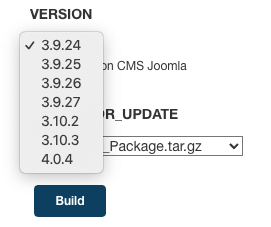

## My project

## Project's reporter: Murashevich Mikhail

Group number: md-sa2-18-21

Description of application for deployment

SCM GitHub

Name: Joomla

Database: MariaDB

Webserver: Apache


## Pipeline

#
```bash
        /-------------http:8080----->>----\         /--> Slack
       /                                   \       /            /->(remote host_1 ansible host: joomla+Apache+MariaDB )
      /                                     \     /            /       
(localhost)-->push-->(GitHub)<-- clone --> (Jenkins) -- deploy --> (remote host_2 ansible host: joomla+Apache+MariaDB )
      \                                                                      /
       \                                                                    /
        \--------------- << -------http:80------ >> -----------------------/
```
#

Technologies which were used in project

Orchestration: Jenkins

Automation tools: Ansible

SCM: Github

Tool for building and managing virtual machine: Vagrant

Notification: Slack


---

CI description

First deploy: 

User copy ssh keys to remote hosts. 
Starting a job with Jenkins UI. All we do is log in, navigate to our job, and click the Build with Parameters
This will take us to a screen that asks for choises for joomla version which we want to deploy.



After clicking Build with Parameters, the changes are sent to the Playbook Joomla [repository](https://github.com/mikevoice/project)

    


Links

### Project [repository](https://github.com/mikevoice/project)
### Jenkinsfile [repository](https://github.com/mikevoice/pipe)
